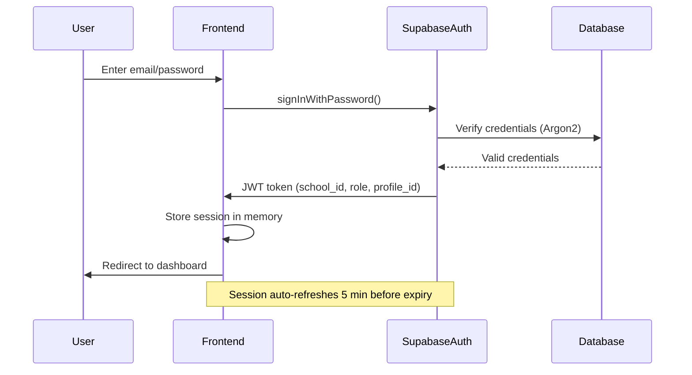
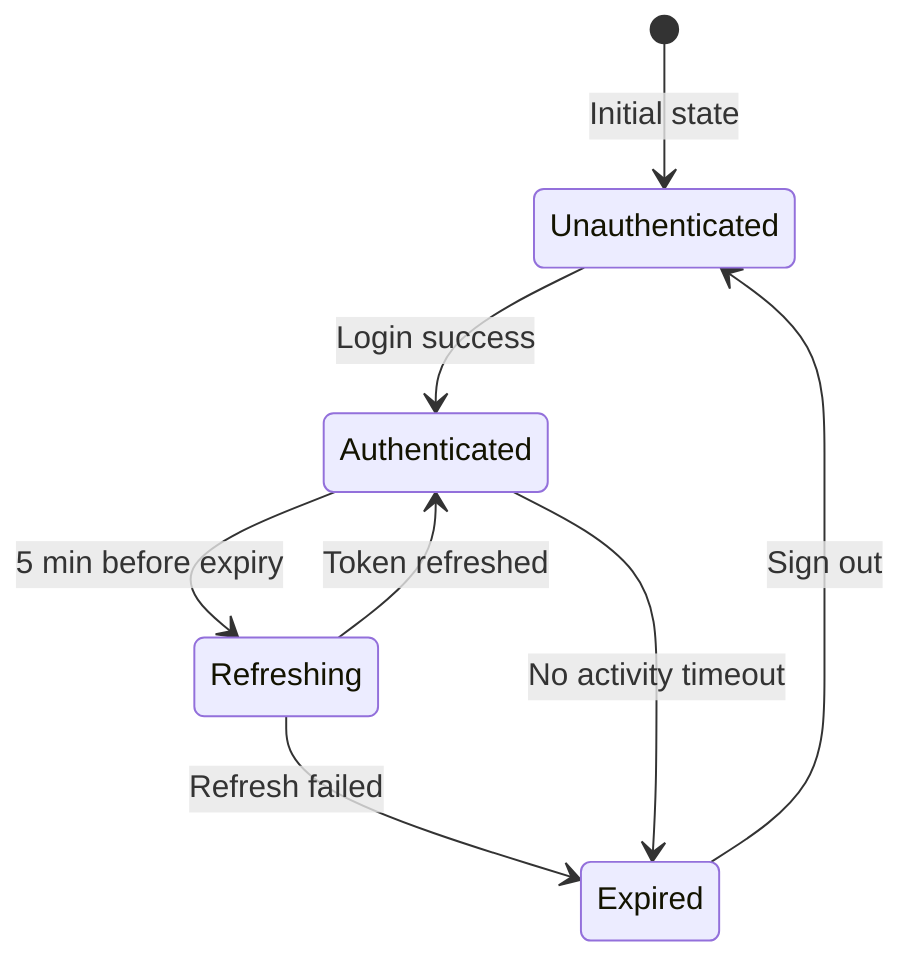
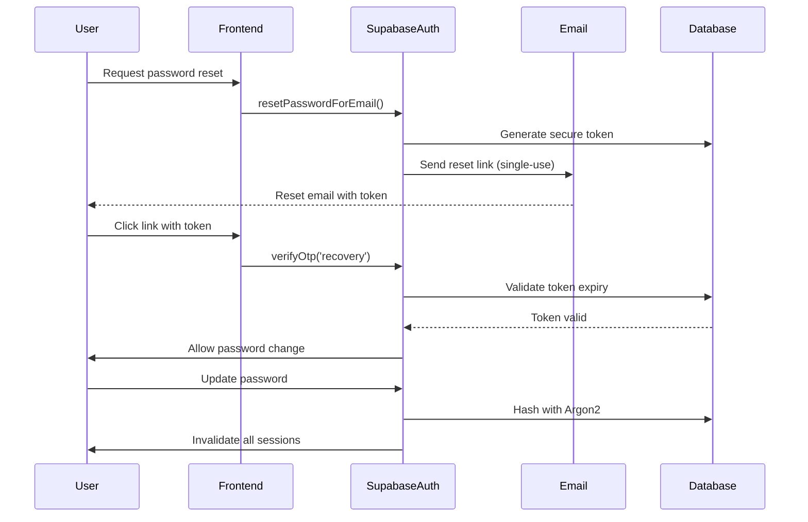

# Authentication Security

> **Version:** 1.0 (Phase 1)  
> **Status:** MVP Foundation  
> **Related:** [Supabase Auth](https://supabase.com/docs/guides/auth)

---

## Authentication Model

CAPFLUX uses **email/password authentication** as the primary mechanism, with **MFA enforcement** planned for all admin roles. The system follows a JWT-based session model with automatic refresh.

### Why This Matters

Financial platforms handling tuition payments and virtual accounts must ensure only authorized users access accounts. Password-only authentication is insufficient for any user with financial privileges.

### Security Benefits

- Prevents unauthorized access to financial data
- Provides non-repudiation for financial actions
- Enables session monitoring and revocation
- Protects against credential stuffing via rate limiting

### Trade-offs

| Aspect | Trade-off |
|--------|-----------|
| **User Experience** | MFA adds friction; acceptable for admin roles |
| **Operational** | Users must manage recovery codes |
| **Technical** | Requires TOTP-compatible authenticator app |

### Implementation Complexity: **Medium**
### Timeline: **MVP**

---

## MVP Authentication Flow



---

## Password Policy

### Requirements

| Rule | Specification |
|------|---------------|
| **Minimum Length** | 12 characters |
| **Maximum Age** | 90 days (admin roles) |
| **History** | Last 5 passwords remembered |
| **Complexity** | Not enforced (discouraged) — use passphrases |
| **Breach Check** | Compare against HaveIBeenPwned |

### Implementation

```sql
-- Password policy stored in app_settings
UPDATE app_settings 
SET settings = jsonb_build_object(
    'password_policy', jsonb_build_object(
        'min_length', 12,
        'max_age_days', 90,
        'history_count', 5,
        'require_uppercase', false,
        'require_lowercase', false,
        'require_numbers', false,
        'require_symbols', false
    )
)
WHERE school_id = current_school_id();
```

---

## Multi-Factor Authentication (MFA)

### Why It Is Necessary

Ransomware attacks and credential theft are common in educational institutions. MFA provides a second barrier even if passwords are compromised.

### Security Benefits

- Prevents account takeover from stolen passwords
- Protects high-value financial operations
- Meets SOC 2/PCI DSS requirements

### Implementation (Supabase)

Supabase supports TOTP-based MFA natively.

```typescript
// Frontend MFA enrollment
import { supabase } from '@/shared/services/api/supabase';

export const MFAService = {
  async enroll() {
    const { data, error } = await supabase.auth.mfa.enroll({
      factorType: 'totp',
      friendlyName: 'CAPFLUX Account',
    });
    
    if (error) throw error;
    return data; // QR code URL, secret, etc.
  },

  async verify(code: string, factorId: string) {
    const { data, error } = await supabase.auth.mfa.challengeAndVerify({
      factorId,
      code,
    });
    
    if (error) throw error;
    return data;
  },

  async unenroll(factorId: string) {
    const { error } = await supabase.auth.mfa.unenroll({ factorId });
    if (error) throw error;
  },

  async listFactors() {
    const { data } = await supabase.auth.mfa.listFactors();
    return data?.all;
  },
};
```

### Protected Roles (MFA Required)

| Role | MFA Required |
|------|--------------|
| Platform Admin | ✅ Yes |
| School Owner | ✅ Yes |
| Accountant | ✅ Yes |
| Cashier | ✅ Yes |
| Registrar | ❌ No |
| Parent | ❌ No |

---

## Session Management

### Session Lifecycle



### Session Expiration

| Timeout Type | Duration |
|--------------|----------|
| **Access Token** | 1 hour |
| **Refresh Token** | 30 days |
| **Inactivity** | 30 minutes (idle) |
| **Absolute Session** | 8 hours (max) |

### JWT Claims Structure

```typescript
export interface CAPFLUXJWT {
  // Standard claims
  sub: string;           // profile_id (UUID)
  email: string;          
  exp: number;           // expiry timestamp
  iat: number;           // issued at
  
  // Custom claims (CAPFLUX-specific)
  school_id: string;       // Tenant identifier
  role: 'OWNER' | 'ADMIN' | 'BURSAR' | 'REGISTRAR' | 'PARENT';  // User role
  admin_status: 'ACTIVE' | 'SUSPENDED';  // Account status
  mfa_verified: boolean;  // Was MFA verified for this session?
}
```

### Refresh Token Rotation

Every refresh generates a new refresh token. Old tokens are invalidated.

```typescript
// AuthService.ts - from existing codebase (enhanced)
_setupTokenRefresh(session: any) {
  // ... existing code ...
  
  // Enhanced: Store refresh token with expiry
  if (session.refresh_token) {
    localStorage.setItem(
      'sb-refresh-expiry',
      (session.expires_at * 1000 + 30 * 24 * 60 * 60 * 1000).toString()
    );
  }
}
```

---

## Device Registration & Trust

### Why It Is Necessary

Users in Africa often share devices or use public computers. Device trust enables:
- Remembering trusted devices
- Requiring MFA on new devices
- Session revocation per device

### Security Benefits

- Detects anomalous login patterns
- Enables device-specific session management
- Supports account recovery flow

### Implementation

```sql
-- Device tracking table
CREATE TABLE user_devices (
    id UUID PRIMARY KEY DEFAULT gen_random_uuid(),
    profile_id UUID NOT NULL REFERENCES profiles(id) ON DELETE CASCADE,
    device_id TEXT NOT NULL,  -- Hash of browser fingerprint
    device_name TEXT,
    user_agent TEXT,
    ip_address INET,
    first_seen TIMESTAMPTZ NOT NULL DEFAULT now(),
    last_seen TIMESTAMPTZ NOT NULL DEFAULT now(),
    is_trusted BOOLEAN NOT NULL DEFAULT false,
    mfa_verified BOOLEAN NOT NULL DEFAULT false,
    created_at TIMESTAMPTZ NOT NULL DEFAULT now()
);

CREATE UNIQUE INDEX idx_user_devices_unique ON user_devices(profile_id, device_id);
```

---

## Account Lockout & Brute-Force Protection

### Rate Limiting (Backend)

```typescript
// Edge Function rate limiting
export const RateLimiter = {
  // Track failed attempts
  async recordFailedAttempt(email: string, ip: string) {
    const key = `login_attempts:${email}:${ip}`;
    const attempts = await redis.incr(key);
    await redis.expire(key, 3600); // 1 hour window
    return attempts;
  },

  async isLockedOut(email: string, ip: string): Promise<boolean> {
    const attempts = await redis.get(`login_attempts:${email}:${ip}`);
    return (attempts ?? 0) >= 5; // 5 attempts per hour
  },

  async clearAttempts(email: string, ip: string) {
    await redis.del(`login_attempts:${email}:${ip}`);
  }
};
```

### Lockout Thresholds

| Attempt Count | Action |
|---------------|--------|
| 1-4 | Warning email (optional) |
| 5 | 15-minute lockout |
| 10 | 1-hour lockout |
| 15+ | Account locked; admin intervention required |

---

## Suspicious Login Detection

### Detection Signals

| Signal | Threshold |
|--------|-----------|
| New device fingerprint | Alert + requires MFA |
| New IP geolocation | Alert + requires MFA |
| Multiple failed attempts | Lockout |
| Login after password change | Alert |
| Login during blackout hours* | Alert + requires MFA |

*Blackout hours: Custom per school (typically nighttime hours in school's timezone)

### Implementation

```typescript
interface LoginContext {
  ip: string;
  userAgent: string;
  deviceId: string;
  timestamp: Date;
  mfaVerified: boolean;
}

export const SuspiciousLoginDetector = {
  async detect(context: LoginContext, profile: Profile): Promise<SuspicionLevel> {
    const signals: string[] = [];
    
    // Check for new device
    const deviceExists = await db.user_devices.get(context.deviceId);
    if (!deviceExists) signals.push('NEW_DEVICE');
    
    // Check for IP anomaly
    const ipHistory = await this.getIpHistory(profile.id);
    if (!ipHistory.includes(context.ip)) signals.push('NEW_IP');
    
    // Check blackout hours
    if (this.isBlackoutHour(context.timestamp, profile.school_id)) {
      signals.push('BLACKOUT_HOUR');
    }
    
    return {
      level: signals.length > 0 ? 'SUSPICIOUS' : 'NORMAL',
      signals,
      requiresMfa: signals.length > 0
    };
  }
};
```

---

## Password Reset Flow

### Secure Reset Process



### Security Controls

1. Tokens are **single-use only**
2. Tokens expire in **1 hour**
3. All sessions invalidated on password change
4. Reset notifications sent to **all registered contact methods**
5. Audit log created for the event

---

## Email Verification

### Why It Is Necessary

Prevents fake account registration and ensures legitimate user contact.

### Implementation

```typescript
export const EmailVerificationService = {
  async sendVerification(email: string) {
    const { error } = await supabase.auth.signInWithOtp({
      email,
      options: {
        shouldCreateUser: false,
        emailRedirectTo: `${window.location.origin}/auth/verify-email`,
      }
    });
    
    if (error) throw error;
  },

  async verify(token: string) {
    const { data, error } = await supabase.auth.verifyOtp({
      token_hash: token,
      type: 'email',
    });
    
    if (error) throw error;
    return data;
  }
};
```

---

## Session Revocation

### Manual Revocation (Admin)

```sql
-- Admin can revoke specific sessions
CREATE OR REPLACE FUNCTION revoke_profile_sessions(
    target_profile_id UUID,
    revoking_admin_id UUID
)
RETURNS INTEGER LANGUAGE plpgsql AS $$
BEGIN
    -- Log the action
    INSERT INTO audit_logs (id, school_id, actor_id, action, entity, entity_id)
    SELECT 
        gen_random_uuid(),
        p.school_id,
        revoking_admin_id,
        'SESSION_REVOKED',
        'profile',
        target_profile_id
    FROM profiles p
    WHERE p.id = target_profile_id;
    
    -- In production: call Supabase Admin API to invalidate tokens
    -- This requires integration with Supabase Management API
    RETURN 1;
END;
$$;
```

### Automatic Revocation Events

| Event | Sessions Affected |
|-------|-------------------|
| Password change | All sessions for that user |
| Role change | All sessions for that user |
| MFA enabled/disabled | All sessions for that user |
| Account suspension | All sessions for that user |
| Security incident declared | All sessions for school |

---

## API Security Headers (Authentication)

```typescript
// Vite security headers config
export default {
  server: {
    headers: {
      'Strict-Transport-Security': 'max-age=31536000; includeSubDomains',
      'X-Frame-Options': 'DENY',
      'X-Content-Type-Options': 'nosniff',
      'X-XSS-Protection': '1; mode=block',
      'Referrer-Policy': 'strict-origin-when-cross-origin',
      'Permissions-Policy': 'clipboard-read=(), clipboard-write=()',
    }
  }
};
```

---

## Implementation Priority

| Priority | Feature | Effort | Target |
|----------|---------|--------|--------|
| **P0** | Password policy, session expiration | Low | MVP |
| **P0** | Account lockout, rate limiting | Low | MVP |
| **P1** | MFA for admin roles | Medium | Growth |
| **P1** | Device registration | Medium | Growth |
| **P2** | Suspicious login detection | High | Enterprise |
| **P2** | Hardware security keys | High | Enterprise |