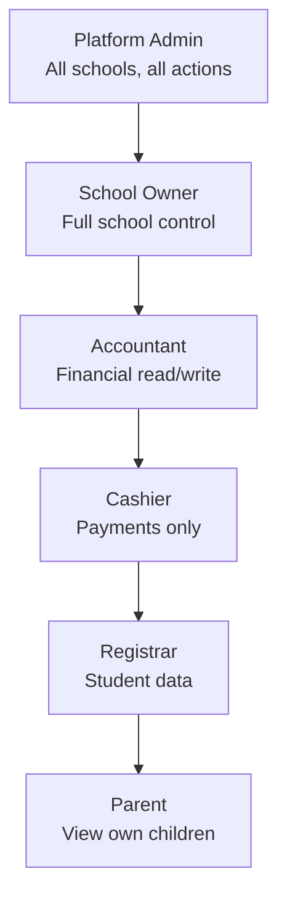
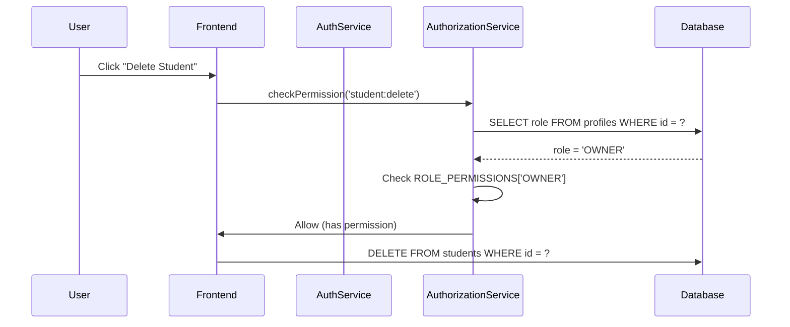
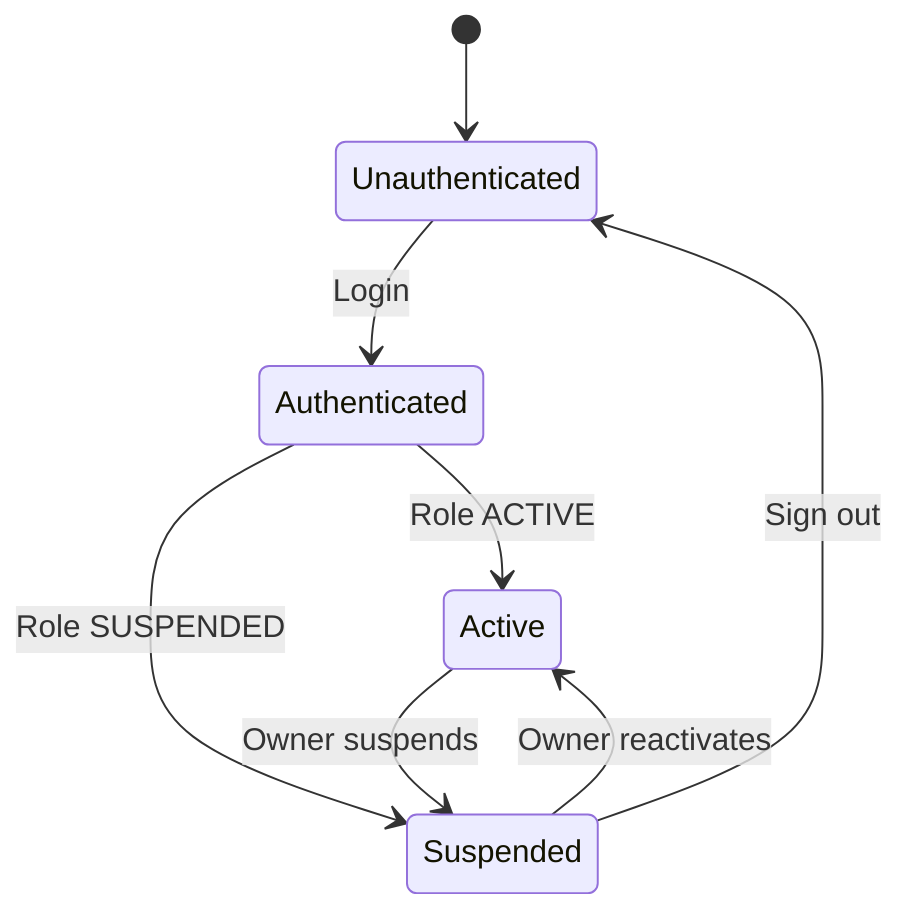

# Authorization Security

> **Version:** 1.0 (Phase 1)  
> **Status:** MVP Foundation  
> **Roles:** 6 MVP roles defined

---

## RBAC Model Overview

CAPFLUX implements **Role-Based Access Control (RBAC)** with permissions at the entity-operation level. This ensures users can only perform actions within their role scope.

### Why It Is Necessary

Financial applications handle sensitive monetary operations. RBAC prevents privilege escalation and limits damage from compromised accounts.

### Security Benefits

- Enforces segregation of duties (SoD)
- Prevents unauthorized financial operations
- Enables compliance auditing
- Supports principle of least privilege

### Implementation Complexity: **Medium**
### Timeline: **MVP**

---

## MVP Roles

### Role Hierarchy



### Role Definitions

| Role | Description | MFA Required | Permissions Scope |
|------|-------------|--------------|-----------------|
| **Platform Admin** | CAPFLUX internal staff managing the platform | ✅ Yes | All schools, all entities |
| **School Owner** | School proprietor/director | ✅ Yes | Own school, all entities |
| **Accountant** | Handles financial records and reporting | ✅ Yes | Ledgers, reports, invoices (read/write) |
| **Cashier** | Records payments, issues receipts | ✅ Yes | Payments, receipts, basic student view |
| **Registrar** | Manages student enrollment and profiles | ❌ No | Students, guardians (read/write) |
| **Parent** | Views children's fees and makes payments | ❌ No | Own children's data only |

---

## Permission Matrix

### Core Permissions

| Permission | Owner | Accountant | Cashier | Registrar | Parent |
|------------|-------|------------|---------|-----------|--------|
| `student:create` | ✅ | ✅ | ✅ | ✅ | ❌ |
| `student:read` | ✅ | ✅ | ✅ | ✅ | Limited |
| `student:update` | ✅ | ❌ | ❌ | ✅ | ❌ |
| `student:delete` | ✅ | ❌ | ❌ | ❌ | ❌ |
| `ledger:read` | ✅ | ✅ | ✅ | ❌ | Limited |
| `ledger:create` | ✅ | ✅ | ✅ | ❌ | ❌ |
| `ledger:update` | ❌ | ❌ | ❌ | ❌ | ❌ |
| `ledger:delete` | ❌ | ❌ | ❌ | ❌ | ❌ |
| `report:generate` | ✅ | ✅ | ❌ | ❌ | ❌ |
| `payment:record` | ✅ | ✅ | ✅ | ❌ | ✅ |
| `settings:update` | ✅ | ❌ | ❌ | ❌ | ❌ |
| `admin:invite` | ✅ | ❌ | ❌ | ❌ | ❌ |
| `admin:suspend` | ✅ | ❌ | ❌ | ❌ | ❌ |

### Financial Permissions

| Permission | Owner | Accountant | Cashier | Registrar | Parent |
|------------|-------|------------|---------|-----------|--------|
| `fee:configure` | ✅ | ❌ | ❌ | ❌ | ❌ |
| `invoice:create` | ✅ | ✅ | ✅ | ❌ | ❌ |
| `invoice:read` | ✅ | ✅ | ✅ | ❌ | Limited |
| `invoice:finalize` | ✅ | ✅ | ❌ | ❌ | ❌ |
| `payment:verify` | ✅ | ✅ | ✅ | ❌ | ❌ |
| `payment:refund` | ✅ | ✅ | ❌ | ❌ | ❌ |
| `settlement:view` | ✅ | ✅ | ❌ | ❌ | ❌ |

### Administrative Permissions

| Permission | Owner | Accountant | Cashier | Registrar | Parent |
|------------|-------|------------|---------|-----------|--------|
| `school:read` | ✅ | ✅ | ✅ | ✅ | ❌ |
| `school:update` | ✅ | ❌ | ❌ | ❌ | ❌ |
| `user:invite` | ✅ | ❌ | ❌ | ❌ | ❌ |
| `user:suspend` | ✅ | ❌ | ❌ | ❌ | ❌ |
| `audit:read` | ✅ | ✅ | ❌ | ❌ | ❌ |

---

## TypeScript Permission Types

```typescript
// Permission constants
export const PERMISSIONS = {
  // Student management
  STUDENT_CREATE: 'student:create',
  STUDENT_READ: 'student:read',
  STUDENT_UPDATE: 'student:update',
  STUDENT_DELETE: 'student:delete',
  
  // Financial operations
  LEDGER_READ: 'ledger:read',
  LEDGER_CREATE: 'ledger:create',
  LEDGER_UPDATE: 'ledger:update',
  LEDGER_DELETE: 'ledger:delete',
  
  // Reporting
  REPORT_GENERATE: 'report:generate',
  REPORT_EXPORT: 'report:export',
  
  // Payments
  PAYMENT_RECORD: 'payment:record',
  PAYMENT_VERIFY: 'payment:verify',
  PAYMENT_REFUND: 'payment:refund',
  
  // Administration
  SCHOOL_READ: 'school:read',
  SCHOOL_UPDATE: 'school:update',
  ADMIN_INVITE: 'admin:invite',
  ADMIN_SUSPEND: 'admin:suspend',
  USER_INVITE: 'user:invite',
  USER_SUSPEND: 'user:suspend',
  
  // Settings
  SETTINGS_UPDATE: 'settings:update',
  FEE_CONFIGURE: 'fee:configure',
  
  // Audit
  AUDIT_READ: 'audit:read',
} as const;

// Role to permissions mapping
export const ROLE_PERMISSIONS: Record<string, string[]> = {
  OWNER: [
    PERMISSIONS.STUDENT_CREATE,
    PERMISSIONS.STUDENT_READ,
    PERMISSIONS.STUDENT_UPDATE,
    PERMISSIONS.STUDENT_DELETE,
    PERMISSIONS.LEDGER_READ,
    PERMISSIONS.LEDGER_CREATE,
    PERMISSIONS.REPORT_GENERATE,
    PERMISSIONS.PAYMENT_RECORD,
    PERMISSIONS.PAYMENT_VERIFY,
    PERMISSIONS.PAYMENT_REFUND,
    PERMISSIONS.SCHOOL_READ,
    PERMISSIONS.SCHOOL_UPDATE,
    PERMISSIONS.ADMIN_INVITE,
    PERMISSIONS.ADMIN_SUSPEND,
    PERMISSIONS.USER_INVITE,
    PERMISSIONS.USER_SUSPEND,
    PERMISSIONS.SETTINGS_UPDATE,
    PERMISSIONS.FEE_CONFIGURE,
    PERMISSIONS.AUDIT_READ,
  ],
  ACCOUNTANT: [
    PERMISSIONS.STUDENT_READ,
    PERMISSIONS.LEDGER_READ,
    PERMISSIONS.LEDGER_CREATE,
    PERMISSIONS.REPORT_GENERATE,
    PERMISSIONS.PAYMENT_RECORD,
    PERMISSIONS.PAYMENT_VERIFY,
    PERMISSIONS.SCHOOL_READ,
    PERMISSIONS.AUDIT_READ,
  ],
  CASHIER: [
    PERMISSIONS.STUDENT_READ,
    PERMISSIONS.LEDGER_READ,
    PERMISSIONS.PAYMENT_RECORD,
    PERMISSIONS.PAYMENT_VERIFY,
    PERMISSIONS.SCHOOL_READ,
  ],
  REGISTRAR: [
    PERMISSIONS.STUDENT_CREATE,
    PERMISSIONS.STUDENT_READ,
    PERMISSIONS.STUDENT_UPDATE,
    PERMISSIONS.SCHOOL_READ,
  ],
  PARENT: [
    PERMISSIONS.PAYMENT_RECORD,
  ],
};
```

---

## Permission Verification Flow



---

## Authorization Service Implementation

```typescript
// frontend/src/shared/services/AuthorizationService.ts
import { supabase, hasSupabaseConfig } from './api/supabase';
import { PERMISSIONS, ROLE_PERMISSIONS } from '@/constants/permissions';

export interface AuthorizationResult {
  allowed: boolean;
  reason?: string;
}

export class AuthorizationService {
  private permissions: string[] = [];
  private role: string | null = null;

  async initialize(): Promise<void> {
    const profile = await this.getProfile();
    if (profile) {
      this.role = profile.role;
      this.permissions = ROLE_PERMISSIONS[profile.role] || [];
    }
  }

  async can(permission: string): Promise<boolean> {
    if (!this.permissions.length) {
      await this.initialize();
    }
    return this.permissions.includes(permission);
  }

  async canAccessStudent(studentId: string): Promise<AuthorizationResult> {
    const { data: student } = await supabase
      .from('students')
      .select('school_id')
      .eq('id', studentId)
      .single();

    if (!student) {
      return { allowed: false, reason: 'Student not found' };
    }

    // For parents, verify relationship via guardian table
    if (this.role === 'PARENT') {
      const { data: guardian } = await supabase
        .from('guardians')
        .select('school_id')
        .eq('profile_id', (await this.getCurrentUserId()))
        .eq('school_id', student.school_id)
        .single();

      if (!guardian) {
        return { allowed: false, reason: 'Parent not linked to this student' };
      }
    }

    return { allowed: true };
  }

  async requirePermission(permission: string): Promise<void> {
    const hasPermission = await this.can(permission);
    if (!hasPermission) {
      throw new Error(`Permission denied: ${permission}`);
    }
  }

  // Used in components
  async guard(permission: string): Promise<boolean> {
    try {
      await this.requirePermission(permission);
      return true;
    } catch {
      return false;
    }
  }

  private async getProfile(): Promise<{ role: string; school_id: string } | null> {
    // ... existing implementation ...
  }

  private async getCurrentUserId(): Promise<string | null> {
    const { data: { user } } = await supabase.auth.getUser();
    return user?.id ?? null;
  }
}
```

---

## Component-Level Guard Example

```vue
<script setup lang="ts">
import { CmButton } from '@/components/ui';
import { AuthorizationService } from '@/shared/services/AuthorizationService';
import { PERMISSIONS } from '@/constants/permissions';

const authz = new AuthorizationService();
const canDeleteStudent = ref(false);

onMounted(async () => {
  canDeleteStudent.value = await authz.guard(PERMISSIONS.STUDENT_DELETE);
});
</script>

<template>
  <CmButton 
    v-if="canDeleteStudent" 
    color="danger" 
    @click="confirmDelete"
  >
    Delete Student
  </CmButton>
</template>
```

---

## Database-Level Authorization (RLS)

RLS enforces tenant isolation. Authorization ensures role-based permissions.

```sql
-- RLS already enforces school_id isolation
-- Additional policy for role-based filtering on students
CREATE POLICY "accountants_can_read_students" ON students
    FOR SELECT
    USING (
        current_profile_role() IN ('OWNER', 'ACCOUNTANT', 'CASHIER', 'REGISTRAR')
        AND current_school_id() = students.school_id
    );

CREATE POLICY "registrar_can_update_students" ON students
    FOR UPDATE
    USING (
        current_profile_role() IN ('OWNER', 'REGISTRAR')
        AND current_school_id() = students.school_id
    );

CREATE POLICY "owner_can_manage_school" ON schools
    FOR UPDATE
    USING (
        current_profile_role() IN ('OWNER')
        AND current_school_id() = schools.id
    );
```

---

## Segregation of Duties (SoD)

| Duty | Role | Notes |
|------|------|-------|
| **Configure Fees** | Owner only | Prevents unauthorized fee changes |
| **Record Payments** | Owner, Accountant, Cashier | Cashiers need to take payments |
| **Verify Refunds** | Owner, Accountant | Dual control for money out |
| **View Reports** | Owner, Accountant | Financial transparency |
| **Manage Users** | Owner only | Central control |
| **Delete Students** | Owner only | Irreversible operation |

---

## Role Transitions



---

## Implementation Priority

| Priority | Feature | Effort | Target |
|----------|---------|--------|--------|
| **P0** | Permission constants & types | Low | MVP |
| **P0** | Role-based guards in components | Low | MVP |
| **P0** | RLS policy hardening | Medium | MVP |
| **P1** | Permission audit logging | Low | Growth |
| **P1** | Dynamic permission assignment | Medium | Growth |
| **P2** | Permission request workflow | High | Enterprise |