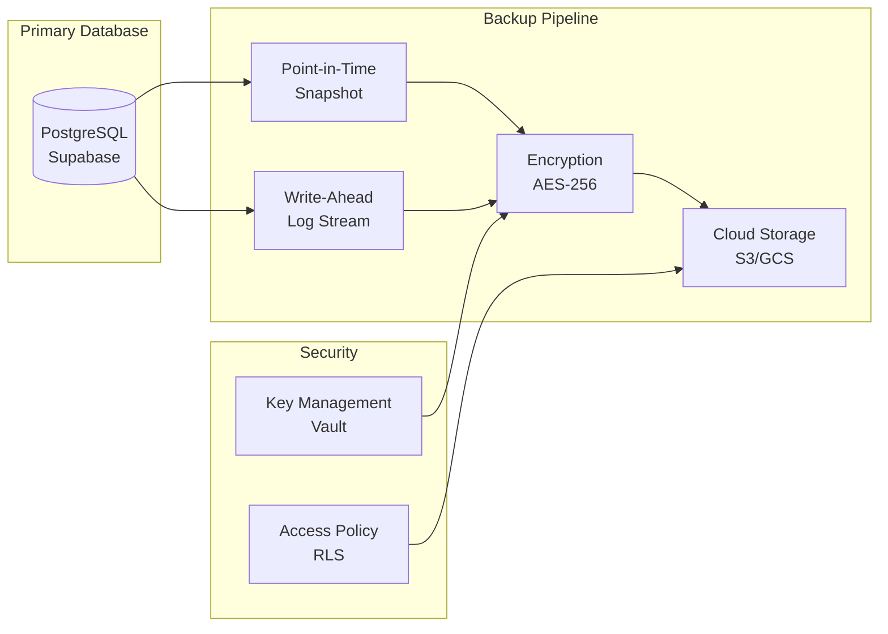

# Backup Strategy Security

> **Version:** 1.0 (Phase 1)  
> **Status:** Critical Infrastructure  

---

## Why Backup Security Is Necessary

School financial data is **irreplaceable**. Backups must be:
- **Encrypted at rest**
- **Access-controlled**
- **Tamper-evident**
- **Regularly tested**

### Security Benefits

- **Prevents data loss**
- **Enables ransomware recovery**
- **Meets compliance requirements**
- **Protects tenant isolation**

### Trade-offs

| Aspect | Trade-off |
|--------|-----------|
| **Cost** | Encrypted backups cost ~2x storage |
| **Recovery Time** | Encryption adds ~10-30s to restore |
| **Complexity** | Multi-tenant restores are complex |

### Implementation Complexity: **Medium**
### Timeline: **MVP**

---

## Backup Architecture



---

## Backup Schedule

### Daily Backups

| Backup Type | Schedule | Retention | Encryption |
|-------------|----------|-----------|------------|
| Full snapshot | 02:00 UTC | 30 days | AES-256 |
| WAL archive | Continuous | 7 days | AES-256 |
| Differential | 02:30 UTC | 7 days | AES-256 |

### Weekly Backups

| Backup Type | Schedule | Retention | Encryption |
|-------------|----------|-----------|------------|
| Full snapshot | Sunday 01:00 UTC | 90 days | AES-256 |

### Monthly Backups

| Backup Type | Schedule | Retention | Encryption |
|-------------|----------|-----------|------------|
| Archive | 1st of month | 7 years | AES-256 |

---

## Encryption at Rest

### Why It Is Necessary

Backups stored in cloud storage must be encrypted to prevent:
- **Cloud provider breach**
- **Employee misuse**
- **Regulatory violation**

### Implementation

Supabase provides **automatic backup encryption**. Verify configuration:

```sql
-- Check encryption status
SELECT 
    datname,
    pg_is_wal_replay_paused(datname) as encryption_enabled
FROM pg_database 
WHERE datname = 'postgres';

-- Verify backup encryption (via Supabase dashboard or support)
-- All backups encrypted with AES-256-GCM by default
```

---

## Point-in-Time Recovery (PITR)

### Why It Is Necessary

Financial corrections require restoring to specific moments.

### Security Benefits

- **Rolls back fraudulent transactions**
- **Recovers from accidental deletes**
- **Meets SLA requirements**

### Recovery Time Objectives (RTO)

| Scenario | RTO Target | RPO Target |
|----------|------------|------------|
| **Critical** (fraud/theft) | 4 hours | 5 minutes |
| **Major** (accidental delete) | 24 hours | 1 hour |
| **Routine** (data corruption) | 72 hours | 24 hours |

### Implementation

```sql
-- PITR via Supabase
-- Using pgBackRest or WAL-G (managed by Supabase)

-- To restore to specific time:
-- SELECT pg_restore_to_timestamp('2026-07-18 14:30:00');

-- Recovery requires:
-- 1. New database instance
-- 2. Restore from base backup
-- 3. Apply WAL until target time
-- 4. Update DNS/connection strings
```

---

## Multi-Tenant Backup Isolation

### Why It Is Necessary

One tenant's backup must not expose another's data.

### Security Benefits

- **Prevents cross-tenant data leak**
- **Supports legal holds**
- **Enables selective restore**

### Implementation

```sql
-- Each backup includes school_id for filtering
-- During restore, extract only specific tenant data

CREATE OR REPLACE FUNCTION restore_school_data(
    target_school_id UUID,
    restore_point TIMESTAMPTZ
)
RETURNS void LANGUAGE plpgsql AS $$
BEGIN
    -- Create temp table for restored data
    CREATE TEMP TABLE temp_restore AS
    SELECT * FROM backup_table 
    WHERE school_id = target_school_id
    AND created_at <= restore_point;
    
    -- Verify isolation
    PERFORM check_no_cross_tenant(temp_restore);
    
    -- Restore to main tables
    INSERT INTO students SELECT * FROM temp_restore;
    INSERT INTO ledger_entries SELECT * FROM temp_restore;
    
    DROP TABLE temp_restore;
END;
$$;
```

---

## Backup Testing

### Why It Is Necessary

Untested backups are **unreliable**. Regular testing ensures:
- **Data is restorable**
- **Encryption keys work**
- **RTO/RPO targets achievable**

### Security Benefits

- **Proves recovery capability**
- **Detects backup corruption**
- **Validates restore procedures**

### Testing Schedule

| Test Type | Frequency | Who | Notes |
|-----------|-----------|-----|-------|
| **Restore test** | Monthly | DevOps | Full restore to test DB |
| **Encryption test** | Quarterly | Security | Verify key access |
| **Integrity test** | Weekly | Automation | Checksum verification |

### Test Script

```bash
#!/bin/bash
# backup_test.sh

# 1. Trigger test backup
supabase db backup --test

# 2. Verify backup exists
if ! supabase db list-backups | grep test-backup; then
    echo "ERROR: Backup not created"
    exit 1
fi

# 3. Test restore to test database
supabase db restore --to-test-db --backup test-backup

# 4. Verify data integrity
psql $TEST_DB -c "SELECT COUNT(*) FROM students;" > /tmp/count.txt

# 5. Cleanup
supabase db delete-backup test-backup
echo "Backup test passed"
```

---

## Backup Access Control

### Who Can Restore

| Role | Permission | MFA Required |
|------|------------|--------------|
| Platform Admin | Full restore | ✅ Yes |
| School Owner | Tenant restore only | ✅ Yes |
| Others | None | N/A |

### Implementation

```sql
-- Restore authorization function
CREATE OR REPLACE FUNCTION authorize_restore(
    requesting_profile UUID,
    target_school UUID
)
RETURNS BOOLEAN LANGUAGE SQL AS $$
    SELECT 
        p.role = 'PLATFORM_ADMIN'
        OR (p.role = 'OWNER' AND p.school_id = target_school);
$$;

-- All restore operations must call this first
-- CREATE POLICY "restore_requires_auth" ON backup_operations ...
```

---

## Backup Monitoring

### Alerts

| Condition | Severity | Alert Channel |
|-----------|----------|---------------|
| Backup failure | Critical | PagerDuty |
| Encryption error | Critical | PagerDuty |
| Storage full (>90%) | Warning | Slack |
| Retention expired | Info | Logs |

---

## Implementation Priority

| Priority | Feature | Effort | Target |
|----------|---------|--------|--------|
| **P0** | Verify Supabase backup encryption | Low | MVP |
| **P0** | Configure backup monitoring | Low | MVP |
| **P1** | Test restore procedures | Medium | Growth |
| **P2** | Multi-tenant selective restore | High | Enterprise |