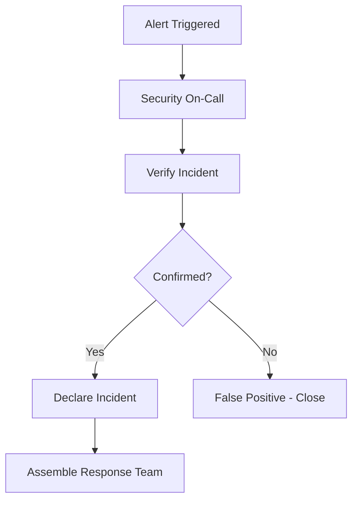

# Disaster Recovery Security

> **Version:** 1.0 (Phase 1)  
> **Status:** Critical Infrastructure  

---

## Why Disaster Recovery Is Necessary

Financial systems must **never lose data**. DR ensures:
- **Business continuity** during outages
- **Compliance** with regulatory requirements
- **Customer trust** in the platform
- **Financial integrity** maintained

### Security Benefits

- **Recovery from attacks** (ransomware, data theft)
- **Prevents permanent data loss**
- **Enables forensic investigation**
- **Supports business continuity**

### Trade-offs

| Aspect | Trade-off |
|--------|-----------|
| **Cost** | DR infrastructure ~3x primary |
| **Complexity** | Multi-region deployment complex |
| **Latency** | DR region may have higher latency |

### Implementation Complexity: **High**
### Timeline: **MVP**

---

## Recovery Time Objectives (RTO)

| Incident Type | RTO Target | RPO Target | Team Response |
|---------------|------------|------------|---------------|
| **Critical** (data theft/corruption) | 4 hours | 5 minutes | 24/7 on-call |
| **Major** (region outage) | 24 hours | 1 hour | Business hours |
| **Minor** (single table corruption) | 72 hours | 24 hours | Next business day |

---

## Recovery Point Objectives (RPO)

| Data Type | RPO Target | Backup Frequency | Notes |
|-----------|------------|------------------|-------|
| **Ledger entries** | 5 minutes | Continuous WAL | Financial integrity |
| **Student records** | 1 hour | Hourly | Enrollment data |
| **Profiles** | 1 hour | Hourly | User management |
| **Settings** | 24 hours | Daily | Configuration |

---

## Incident Response Playbook

### 1. Detection



### 2. Classification

| Severity | Criteria | Response Time |
|----------|----------|---------------|
| **S1 - Critical** | Financial data theft/ corruption | 15 minutes |
| **S2 - Major** | Service outage, tenant isolation breach | 1 hour |
| **S3 - Minor** | Non-financial data issue | 4 hours |

### 3. Response Steps

#### S1: Critical Financial Incident

```bash
#!/bin/bash
# incident-response-critical.sh

# Step 1: Isolate affected tenant
supabase db disable-tenant $SCHOOL_ID

# Step 2: Capture forensic image
pg_dump --schema-only --data-only --table=ledger_entries > /forensics/ledger_dump.sql

# Step 3: Disable sync for tenant
supabase functions disable-sync --school-id $SCHOOL_ID

# Step 4: Notify stakeholders
slack-alert "#security" "CRITICAL: Financial incident at $SCHOOL_ID"

# Step 5: Begin investigation
start-forensic-investigation $INCIDENT_ID
```

#### S2: Major Outage

```bash
#!/bin/bash
# incident-response-major.sh

# Step 1: Activate DR environment
terraform apply -var="region=us-west-2"

# Step 2: Update DNS
cloudflare-dns update --service capflux.ng --target $DR_ENDPOINT

# Step 3: Monitor failover
until curl -sf $DR_ENDPOINT/health; do sleep 5; done

# Step 4: Notify customers
send-sms-bulk "CAPFLUX service temporarily moved. No action required."
```

---

## Database Restoration Procedure

### Point-in-Time Recovery

```bash
#!/bin/bash
# restore-pitr.sh

# 1. Identify restore point
RESTORE_TIME=$(date -d "$RECOVERY_POINT" +%s)

# 2. Create new instance
supabase projects create capflux-restore-$TIMESTAMP \
    --region $BACKUP_REGION

# 3. Wait for provisioning
sleep 600  # 10 minutes

# 4. Restore from backup
supabase db restore \
    --project-ref capflux-restore-$TIMESTAMP \
    --point-in-time $RECOVERY_POINT

# 5. Verify restoration
psql $RESTORE_DB -c "SELECT COUNT(*) FROM ledger_entries;" \
    | grep -q $EXPECTED_COUNT \
    || exit 1

# 6. Apply RLS policies
supabase db push --project-ref capflux-restore-$TIMESTAMP \
    --file ./supabase/policies/rls_hardening.sql

# 7. Update application config
echo "RESTORE_DB_URL=$RESTORE_DB" >> .env
```

### Tenant-Specific Restore

```sql
-- Restore single tenant to specific point
BEGIN;

-- Disable RLS temporarily for restoration
SET SESSION AUTHORIZATION DEFAULT;

-- Restore specific tenant data
CREATE TEMP TABLE temp_restore AS
SELECT * FROM backup_table 
WHERE school_id = $TARGET_SCHOOL_ID
AND created_at <= $RESTORE_TIMESTAMP;

-- Verify no cross-tenant data
SELECT COUNT(*) FROM temp_restore 
WHERE school_id != $TARGET_SCHOOL_ID;
-- Must return 0

-- Truncate target tables
TRUNCATE students, ledger_entries, notifications 
WHERE school_id = $TARGET_SCHOOL_ID;

-- Restore data
INSERT INTO students SELECT * FROM temp_restore_students;
INSERT INTO ledger_entries SELECT * FROM temp_restore_ledger;

COMMIT;
```

---

## Communication Plan

### Internal Notification

| Role | Channel | SLA |
|------|---------|-----|
| Security team | PagerDuty | 5 min |
| Engineering | Slack #ops | 15 min |
| Management | SMS + Email | 1 hour |

### Customer Notification

| Scenario | Template | Timing |
|----------|----------|--------|
| **Outage** | "Service temporarily offline. We're working to restore." | Immediately |
| **Data breach** | "Potential security incident. No action needed yet." | Within 2 hours |
| **Data restoration** | "Service restored. Previous data recovered." | After restore |
| **Investigation complete** | "Incident resolved. See status report." | Final |

---

## DR Testing Schedule

| Test Type | Frequency | Who | Notes |
|-----------|-----------|-----|-------|
| **Full restore test** | Quarterly | Security team | End-to-end |
| **Tenant restore test** | Monthly | Engineering | Isolation check |
| **PITR test** | Bi-annually | Engineering | Timestamp accuracy |
| **Failover test** | Annually | Operations | DNS propagation |

---

## Implementation Priority

| Priority | Feature | Effort | Target |
|----------|---------|--------|--------|
| **P0** | Backup verification | Low | MVP |
| **P0** | Restore procedures documented | Medium | MVP |
| **P1** | DR environment provisioning | High | Growth |
| **P2** | Automated failover | High | Enterprise |