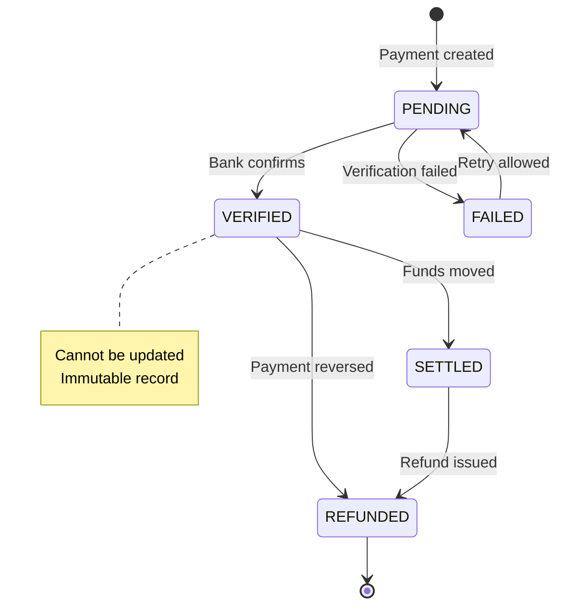

# Financial Integrity Architecture

> **Version:** 1.0 (Phase 1)  
> **Status:** Core Application Feature  

---

## Why Financial Integrity Is Necessary

Financial software must maintain **mathematical accuracy** and **legal compliance**. Unlike CRUD applications, financial data:
- Cannot be corrected by simple updates
- Must balance to the penny
- Requires immutable audit trails
- Must support external reconciliation

### Security Benefits

- **Prevents financial fraud**
- **Ensures accounting accuracy**
- **Supports regulatory compliance**
- **Enables forensic reconstruction**

### Trade-offs

| Aspect | Trade-off |
|--------|-----------|
| **Complexity** | Corrections require reversal entries |
| **Storage** | More records stored for corrections |
| **Developer Experience** | Must understand accounting principles |

### Implementation Complexity: **High**
### Timeline: **MVP** (Critical)

---

## Append-Only Ledger Design

### Why It Is Necessary

Financial records must be **tamper-evident** and **legally defensible**. Deletions or arbitrary updates would:
- Allow fraud concealment
- Break audit trail continuity
- Violate compliance requirements

### Implementation

```sql
-- No UPDATE or DELETE on ledger entries
-- Corrections use reversal + new entry

-- Instead of: UPDATE ledger_entries SET amount = 5000 WHERE id = 'xxx'
-- Use:
-- INSERT reversal entry (CREDIT for original DEBIT)
-- INSERT correction entry (DEBIT with correct amount)

CREATE OR REPLACE FUNCTION reverse_ledger_entry(
    original_entry_id UUID,
    reason TEXT
)
RETURNS UUID LANGUAGE plpgsql AS $$
DECLARE
    v_original RECORD;
    v_new_id UUID;
BEGIN
    -- Get original entry
    SELECT * INTO v_original FROM ledger_entries WHERE id = original_entry_id;
    
    -- Create reversal
    INSERT INTO ledger_entries (
        id, school_id, student_id, amount, entry_type,
        entry_category, metadata, client_sequence, device_id
    ) VALUES (
        gen_random_uuid(),
        v_original.school_id,
        v_original.student_id,
        v_original.amount,
        CASE WHEN v_original.entry_type = 'DEBIT' THEN 'CREDIT' ELSE 'DEBIT' END,
        'ADJUSTMENT',
        jsonb_build_object(
            'original_entry_id', original_entry_id,
            'reason', reason,
            'type', 'reversal'
        ),
        v_original.client_sequence + 10000,  -- Offset to show relationship
        'system-adjustment',
        now()
    ) RETURNING id INTO v_new_id;
    
    -- Audit
    PERFORM log_audit_action(
        current_profile_id(),
        'LEDGER_REVERSAL',
        'ledger_entries',
        original_entry_id,
        jsonb_build_object('reversal_id', v_new_id, 'reason', reason)
    );
    
    RETURN v_new_id;
END;
$$;
```

---

## Double-Entry Accounting Pattern

### Why It Is Necessary

Every financial transaction affects two accounts: debtor and creditor.

### Implementation

```sql
-- Every payment creates paired entries
-- Payment IN: School owes less (DEBIT to revenue)
-- Payment OUT: Student owes less (CREDIT to receivable)

CREATE OR REPLACE FUNCTION record_payment(
    p_school_id UUID,
    p_student_id UUID,
    p_amount NUMERIC,
    p_reference_id UUID
)
RETURNS TABLE (
    debit_entry UUID,
    credit_entry UUID
) LANGUAGE plpgsql AS $$
DECLARE
    v_debit_id UUID;
    v_credit_id UUID;
BEGIN
    -- Debit: Reduce student receivable (money received)
    INSERT INTO ledger_entries (
        id, school_id, student_id, amount, entry_type,
        entry_category, reference_id, client_sequence, device_id
    ) VALUES (
        gen_random_uuid(),
        p_school_id,
        p_student_id,
        p_amount,
        'CREDIT',  -- Student owes less
        'TUITION',
        p_reference_id,
        next_client_sequence(p_school_id),
        'system-payment'
    ) RETURNING id INTO v_credit_id;
    
    -- Credit: Increase school revenue
    INSERT INTO ledger_entries (
        id, school_id, student_id, amount, entry_type,
        entry_category, reference_id, client_sequence, device_id
    ) VALUES (
        gen_random_uuid(),
        p_school_id,
        p_student_id,
        p_amount,
        'DEBIT',   -- Revenue increased
        'TUITION',
        p_reference_id,
        next_client_sequence(p_school_id) + 1,
        'system-payment'
    ) RETURNING id INTO v_debit_id;
    
    RETURN QUERY SELECT v_debit_id, v_credit_id;
END;
$$;
```

---

## Payment State Machine

### Why It Is Necessary

Payments have complex lifecycles requiring state validation.

### States



### Implementation

```typescript
export type PaymentStatus = 
  | 'PENDING'    // Awaiting verification
  | 'VERIFIED'   // Bank confirmed
  | 'SETTLED'    // Funds transferred
  | 'FAILED'     // Verification failed
  | 'REFUNDED'   // Payment reversed;
  | 'DISPUTED';  // Under investigation

// State transitions validated
export const PaymentStateMachine = {
  canTransition(from: PaymentStatus, to: PaymentStatus): boolean {
    const allowed: Record<PaymentStatus, PaymentStatus[]> = {
      PENDING: ['VERIFIED', 'FAILED'],
      VERIFIED: ['SETTLED', 'REFUNDED', 'DISPUTED'],
      SETTLED: ['REFUNDED', 'DISPUTED'],
      FAILED: ['PENDING'],
      REFUNDED: [],
      DISPUTED: ['VERIFIED', 'REFUNDED']
    };
    
    return allowed[from].includes(to);
  }
};
```

---

## Idempotency & Duplicate Protection

### Why It Is Necessary

Network retries and offline sync can cause duplicate payments.

### Implementation

```sql
-- Unique constraint on payment reference
CREATE UNIQUE INDEX idx_payments_reference 
ON ledger_entries (school_id, reference_id) 
WHERE entry_category = 'TUITION';

-- Idempotency key for payments
ALTER TABLE ledger_entries ADD COLUMN idempotency_key TEXT;

-- Function to check duplicates
CREATE OR REPLACE FUNCTION is_duplicate_payment(
    p_school_id UUID,
    p_reference TEXT
)
RETURNS BOOLEAN LANGUAGE SQL AS $$
    SELECT EXISTS (
        SELECT 1 FROM ledger_entries
        WHERE school_id = p_school_id
        AND (reference_id::TEXT = p_reference 
             OR idempotency_key = p_reference)
    );
$$;
```

---

## Reconciliation Algorithm

### Why It Is Necessary

Daily reconciliation catches discrepancies before they compound.

### Implementation

```sql
CREATE OR REPLACE FUNCTION reconcile_school_day(
    p_school_id UUID,
    p_date DATE
)
RETURNS TABLE (
    opening_balance NUMERIC,
    daily_debits NUMERIC,
    daily_credits NUMERIC,
    expected_balance NUMERIC,
    actual_balance NUMERIC,
    discrepancy NUMERIC,
    status TEXT
) LANGUAGE plpgsql AS $$
DECLARE
    v_opening NUMERIC;
    v_daily_debits NUMERIC;
    v_daily_credits NUMERIC;
BEGIN
    -- Opening balance (before date)
    SELECT school_balance(p_school_id, p_date - interval '1 day')
    INTO v_opening;
    
    -- Sum of daily entries
    SELECT 
        COALESCE(SUM(CASE WHEN entry_type = 'DEBIT' THEN amount ELSE 0 END), 0),
        COALESCE(SUM(CASE WHEN entry_type = 'CREDIT' THEN amount ELSE 0 END), 0)
    INTO v_daily_debits, v_daily_credits
    FROM ledger_entries
    WHERE school_id = p_school_id
    AND created_at::DATE = p_date;
    
    -- Expected = opening + debits - credits
    -- For schools: debits = money in, credits = money out
    RETURN QUERY SELECT 
        v_opening,
        v_daily_debits,
        v_daily_credits,
        v_opening + v_daily_debits - v_daily_credits,
        school_balance(p_school_id, p_date),
        ABS((v_opening + v_daily_debits - v_daily_credits) - school_balance(p_school_id, p_date)),
        CASE WHEN discrepancy = 0 THEN 'BALANCED' ELSE 'DISCREPANCY' END
    ;
END;
$$;
```

---

## Clock Skew Handling

### Why It Is Necessary

Offline devices have wrong clocks, affecting financial ordering.

### Implementation

```sql
-- Server assigns authoritative timestamps
ALTER TABLE ledger_entries 
ALTER COLUMN created_at SET DEFAULT now();

-- Client uses sequence numbers for ordering
CREATE OR REPLACE FUNCTION validate_timestamp(
    p_client_time TIMESTAMPTZ,
    p_school_id UUID
)
RETURNS BOOLEAN LANGUAGE SQL AS $$
    SELECT 
        ABS(EXTRACT(EPOCH FROM (p_client_time - now()))) < 300  -- 5 min tolerance
    AND EXISTS (SELECT 1 FROM schools WHERE id = p_school_id);
$$;
```

---

## Implementation Priority

| Priority | Feature | Effort | Target |
|----------|---------|--------|--------|
| **P0** | Append-only ledger | Low | MVP |
| **P0** | Payment state machine | Medium | MVP |
| **P0** | Idempotency keys | Low | MVP |
| **P1** | Reconciliation procedure | Medium | Growth |
| **P1** | Double-entry verification | Medium | Growth |
| **P2** | Month-end closing | High | Enterprise |