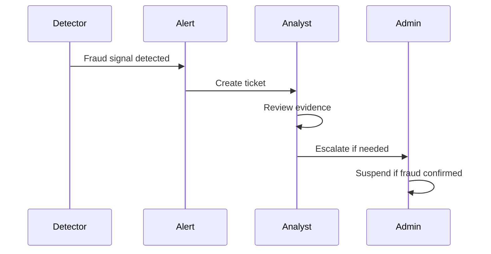

# Fraud Detection Security

> **Version:** 1.0 (Phase 1)  
> **Status:** MVP Required  

---

## Why Fraud Detection Is Necessary

Most financial attacks exploit **legitimate user accounts** rather than technical vulnerabilities. Detection prevents:
- **Internal theft**
- **Compromised accounts**
- **Payment manipulation**
- **Data harvesting**

### Security Benefits

- **Early threat detection**
- **Automated response**
- **Reduced financial loss**
- **Compliance support**

### Trade-offs

| Aspect | Trade-off |
|--------|-----------|
| **False positives** | Legitimate activity flagged |
| **Performance** | Real-time analysis adds latency |
| **Privacy** | User behavior tracked |

### Implementation Complexity: **Medium**
### Timeline: **Growth**

---

## Detection Rules

### Payment Timing Anomalies

```typescript
// Impossible payment timing
export const PaymentTimingDetector = {
  async detectImpossibleTiming(
    payment: Payment,
    previousPayment: Payment
  ): Promise<FraudSignal | null> {
    const timeDiff = payment.created_at.getTime() - previousPayment.created_at.getTime();
    
    // Less than 100ms - suspicious
    if (timeDiff < 100) {
      return {
        type: 'IMPOSSIBLE_TIMING',
        risk: 'HIGH',
        reason: 'Payments too close together'
      };
    }
    
    return null;
  }
};
```

### Duplicate Payment Detection

```sql
-- Multiple payments with same reference
SELECT 
    reference_id,
    COUNT(*) as payment_count,
    SUM(amount) as total_amount
FROM ledger_entries
WHERE created_at > now() - interval '1 hour'
GROUP BY reference_id
HAVING COUNT(*) > 1;
```

### Same Receipt Uploaded Repeatedly

```typescript
// Receipt hash comparison
export const ReceiptDuplicateDetector = {
  async checkDuplicateHash(hash: string): Promise<boolean> {
    const { data } = await supabase
      .from('payment_transactions')
      .select('id')
      .eq('receipt_hash', hash)
      .single();
    
    return !!data;
  }
};
```

---

## Velocity Detection

### Payment Velocity

| Threshold | Action |
|-----------|--------|
| > 10 payments/hour | Alert |
| > 50 payments/hour | Block + MFA |
| > 100 payments/hour | Lock account |

### Login Velocity

| Threshold | Action |
|-----------|--------|
| > 5 failed logins/15min | Lock account 15min |
| > 10 failed logins/hour | Lock account 1hr |
| > 20 failed logins | Require admin unlock |

### Implementation

```sql
-- Payment velocity view
CREATE VIEW payment_velocity AS
SELECT 
    school_id,
    profile_id,
    COUNT(*) as payments_last_hour,
    SUM(amount) as amount_last_hour
FROM payment_transactions
WHERE created_at > now() - interval '1 hour'
GROUP BY school_id, profile_id
HAVING COUNT(*) > 10;
```

---

## Geographic Anomaly Detection

### Why It Is Necessary

Payments from unexpected countries may indicate fraud.

### Implementation

```typescript
export const GeoAnomalyDetector = {
  async checkLocation(ip: string, profile: Profile): Promise<GeoSignal> {
    const location = await this.geolocateIP(ip);
    const lastLocation = await this.getLastKnownLocation(profile.id);
    
    // Check if country changed
    if (location.country !== lastLocation?.country) {
      // Allow if same region (within Africa)
      if (!this.isSameRegion(location.country, lastLocation?.country)) {
        return {
          type: 'GEO_ANOMALY',
          risk: 'MEDIUM',
          requiresReview: true
        };
      }
    }
    
    return { type: 'OK', risk: 'NONE' };
  }
};
```

---

## Alert Configuration

### High-Risk Alerts (Immediate)

| Event | Channel | Action |
|-------|---------|--------|
| Large payment (>500K) | SMS + PagerDuty | Require MFA |
| Impossible timing | PagerDuty | Auto-block |
| Multiple country logins | SMS | Require review |
| Account suspension bypass | PagerDuty | Lock immediately |

### Medium-Risk Alerts (Review)

| Event | Channel | Action |
|-------|---------|--------|
| High velocity | Email | Review within 24h |
| Unusual hours | Email | Log for review |
| Multiple parents same account | Email | Investigate |
| Receipt duplicate | Slack | Manual check |

---

## Fraud Investigation Procedure



---

## Implementation Priority

| Priority | Feature | Effort | Target |
|----------|---------|--------|--------|
| **P1** | Duplicate payment detection | Low | Growth |
| **P1** | Payment velocity limits | Medium | Growth |
| **P2** | Geographic detection | Medium | Enterprise |
| **P2** | Machine learning detection | High | Enterprise |