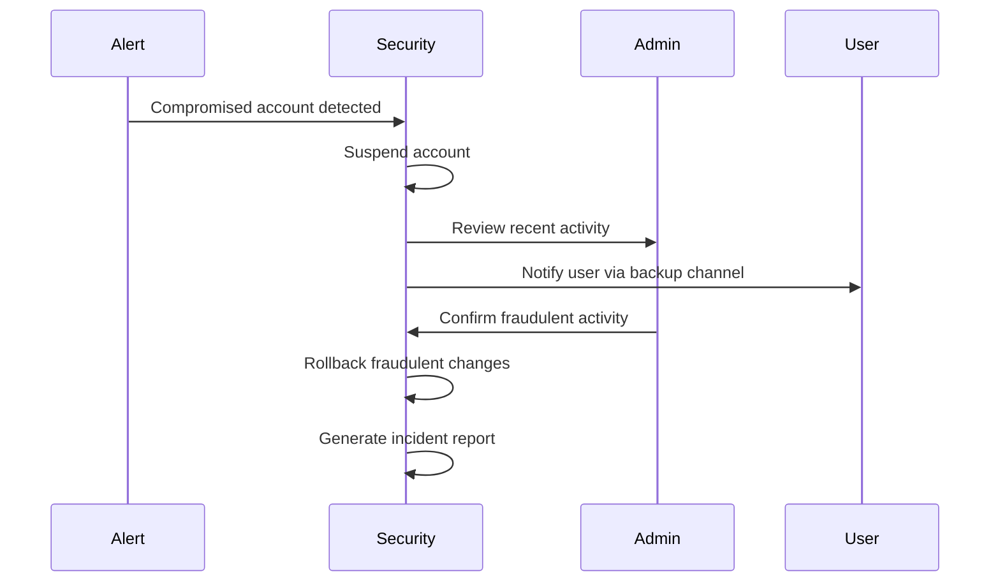
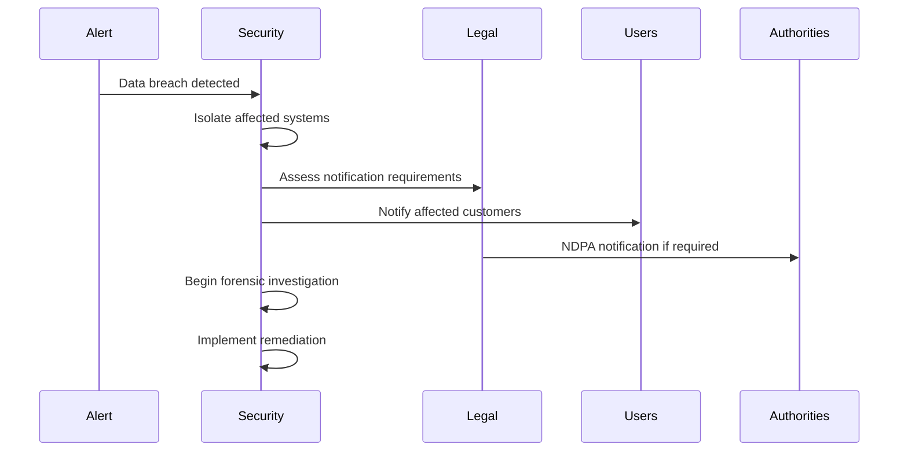
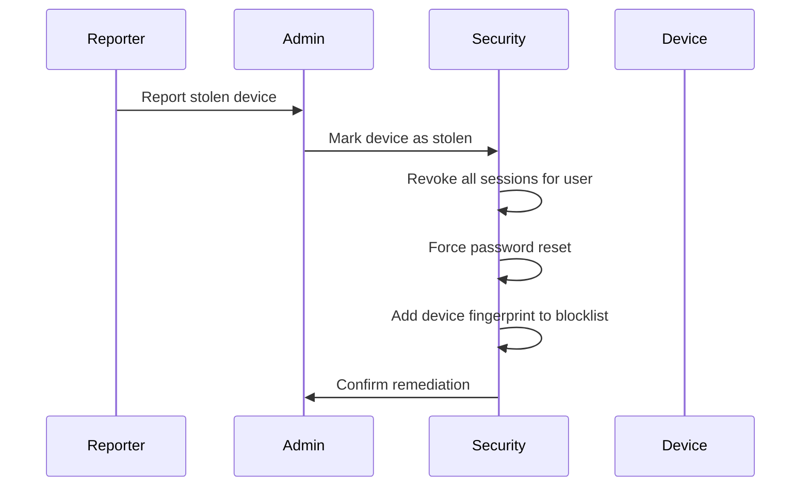

# Incident Response Security

> **Version:** 1.0 (Phase 1)  
> **Status:** Critical for Production  

---

## Why Incident Response Is Necessary

When (not if) security incidents occur, a prepared response prevents:
- **Financial loss escalation**
- **Data breach expansion**
- **Reputation damage**
- **Regulatory penalties**

### Security Benefits

- **Minimizes impact**
- **Ensures proper handling**
- **Supports compliance**
- **Enables learning**

### Trade-offs

| Aspect | Trade-off |
|--------|-----------|
| **Preparation time** | Must be ready before incidents |
| **Drills required** | Regular testing needed |

### Implementation Complexity: **Medium**
### Timeline: **MVP**

---

## Incident Classification

### S1 - Critical (Financial)

| Scenario | Examples | Response Time |
|----------|----------|---------------|
| Payment fraud | Stolen money | 15 minutes |
| Ledger tampering | Modified entries | 30 minutes |
| Account takeover | Admin compromised | 15 minutes |
| Data exfiltration | Student records stolen | 1 hour |

### S2 - Major (Service)

| Scenario | Examples | Response Time |
|----------|----------|---------------|
| Service outage | Database down | 1 hour |
| Tenant isolation breach | Cross-school data | 1 hour |
| API abuse | Scraping, spam | 4 hours |

### S3 - Minor (Operational)

| Scenario | Examples | Response Time |
|----------|----------|---------------|
| Minor bug | UI issue | 24 hours |
| Performance issue | Slow queries | 8 hours |
| False positive alert | Incorrect detection | 24 hours |

---

## Response Playbooks

### Playbook 1: Account Compromise



### Playbook 2: Data Breach



### Playbook 3: Offline Device Theft



---

## Communication Templates

### Customer Notification

```
SUBJECT: Security Notice - Capstone Account Activity

We detected unusual activity on your account on [DATE] at [TIME].
We have temporarily suspended your account to prevent unauthorized access.

What happened: [Brief description]

What we're doing: [Remediation steps]

What you need to do: [User action required]

Questions? Contact security@capstone.ng
```

### Regulatory Notification (NDPA)

```
To: National Data Protection Bureau
Subject: Mandatory Breach Notification

Organization: Capstone Software Solutions Ltd
Date of breach: [DATE]
Nature of breach: [Description]
Data affected: [Types and quantities]
Remedial actions: [Steps taken]
Contact: [DPO contact]
```

---

## Evidence Preservation

### What to Preserve

| Evidence | Location | Retention |
|----------|----------|-----------|
| Database snapshot | Backup storage | Indefinite |
| Audit logs | Log archive | 7 years |
| Network logs | SIEM | 90 days |
| Device images | Forensics storage | 2 years |
| Communication | Email archive | 2 years |

### Forensic Collection

```bash
#!/bin/bash
# collect_evidence.sh

INCIDENT_ID=$1
TIMESTAMP=$(date +%s)

# Database evidence
pg_dump --data-only --table=ledger_entries --table=students > /forensics/$INCIDENT_ID-db-$TIMESTAMP.sql

# Audit log evidence
supabase db dump --query "SELECT * FROM audit_logs WHERE created_at > now() - interval '24 hours'" > /forensics/$INCIDENT_ID-audit-$TIMESTAMP.json

# API logs
cp /var/log/nginx/access.log /forensics/$INCIDENT_ID-api-$TIMESTAMP.log

# Calculate checksums
sha256sum /forensics/$INCIDENT_ID-* > /forensics/$INCIDENT_ID.checksums
```

---

## Recovery Steps

### Financial Recovery

1. **Identify fraudulent transactions** via audit logs
2. **Create reversal entries** for each fraud
3. **Verify correct balance** after reversals
4. **Document changes** in audit log
5. **Notify affected parties** if required

### Data Recovery

1. **Isolate affected tenant** (RLS + account suspension)
2. **Restore from last good backup**
3. **Re-apply legitimate changes** since backup
4. **Verify data integrity**
5. **Re-enable access**

---

## Post-Incident Activities

### Root Cause Analysis

| Question | Answer |
|----------|--------|
| What happened? | Timeline of events |
| Why did it happen? | Vulnerability exploited |
| How did we detect it? | Alert mechanism |
| How did we respond? | Actions taken |
| How do we prevent recurrence? | Remediation steps |

### Remediation Tracking

```sql
CREATE TABLE incident_remediation (
    id UUID PRIMARY KEY DEFAULT gen_random_uuid(),
    incident_id UUID NOT NULL,
    action TEXT NOT NULL,
    status TEXT NOT NULL,  -- PENDING, IN_PROGRESS, DONE
    owner UUID NOT NULL REFERENCES profiles(id),
    due_date DATE,
    completed_at TIMESTAMPTZ,
    created_at TIMESTAMPTZ DEFAULT now()
);
```

---

## Incident Response Team

| Role | Contact | Availability |
|------|---------|--------------|
| **Incident Lead** | security@capstone.ng | 24/7 |
| **Engineering Lead** | on-call@capstone.ng | 24/7 |
| **Legal Contact** | legal@capstone.ng | Business hours |
| **PR Contact** | pr@capstone.ng | Business hours |
| **External Counsel** | [Law firm] | Retainer |

---

## Implementation Priority

| Priority | Feature | Effort | Target |
|----------|---------|--------|--------|
| **P0** | Incident classification | Low | MVP |
| **P0** | Communication templates | Low | MVP |
| **P1** | Response playbooks documented | Medium | Growth |
| **P2** | Forensic tooling | High | Enterprise |