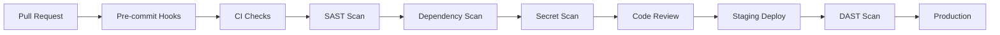

# Secure Development Lifecycle

> **Version:** 1.0 (Phase 1)  
> **Status:** Mandatory for All Development  

---

## Why Secure Development Is Necessary

Most security breaches come from **code vulnerabilities**, not infrastructure. A secure development lifecycle (SDLC) prevents:
- **Vulnerable code** reaching production
- **Dependencies** introducing known exploits
- **Secrets** leaking to version control
- **Security bugs** slipping through review

### Security Benefits

- **Proactive vulnerability detection**
- **Compliance with secure coding standards**
- **Reduced incident response burden**
- **Improved code quality**

### Trade-offs

| Aspect | Trade-off |
|--------|-----------|
| **Velocity** | Security checks add ~1 day to release cycle |
| **Tooling** | SAST/DAST tools cost $200-500/month |
| **Training** | Developers need security training |

### Implementation Complexity: **Medium**
### Timeline: **MVP**

---

## Development Pipeline Security



---

## Pre-commit Hooks

### What To Check

| Hook | Tool | Purpose |
|------|------|---------|
| **ESLint security** | eslint-plugin-security | Find unsafe code |
| **Secret detection** | detect-secrets | Prevent credential leaks |
| **TypeScript strict** | tsc --noEmit | Type safety |
| **Format check** | prettier | Consistent code |

### Configuration (.husky/pre-commit)

```bash
#!/bin/sh
. "$(dirname "$0")/_/husky.sh"

# Stop on any error
set -e

# Lint and type check
npm run lint:security
npm run type-check

# Check for secrets
npx detect-secrets-hook --baseline .secrets.baseline

# Format check
npx prettier --check .

# Run unit tests
npm test -- --changedSince=HEAD
```

---

## Dependency Scanning

### Why It Is Necessary

Third-party packages introduce **supply chain attacks**.

### Security Benefits

- **Prevents known vulnerability exploitation**
- **Catches outdated dependencies**
- **Blocks malicious packages**

### Implementation

```json
// package.json
{
  "scripts": {
    "security:audit": "npm audit --audit-level high",
    "security:scan": "npx audit-ci --high",
    "security:check": "npm run security:audit && npm run security:scan"
  }
}
```

```yaml
# .github/workflows/security.yml
name: Security Scan
on: [push, pull_request]

jobs:
  security:
    runs-on: ubuntu-latest
    steps:
      - uses: actions/checkout@v3
      - uses: actions/setup-node@v3
      - run: npm ci
      - run: npm run security:check
      - uses: github/codeql-action/analyze@v2
```

---

## Secret Scanning

### Why It Is Necessary

API keys, passwords, and tokens in code are **immediate compromise vectors**.

### Security Benefits

- **Prevents credential exposure**
- **Stops accidental commits**
- **Protects cloud infrastructure**

### Implementation

```bash
# .secrets.baseline - generated by:
detect-secrets scan > .secrets.baseline

# Pre-commit hook
detect-secrets-hook --baseline .secrets.baseline

# CI check
detect-secrets-hook --baseline .secrets.baseline --update .secrets.baseline
```

### Secrets Never Allowed In

- Source code files
- Configuration files
- Documentation
- Test fixtures (use mocks)
- Environment files (.env)

### Allowed Secret Patterns

```
# In .secrets.baseline
SECRET_KEY=xxx
API_KEY=xxx
PASSWORD=xxx
TOKEN=xxx
```

---

## Static Analysis (SAST)

### Why It Is Necessary

Code patterns can be analyzed for security vulnerabilities before runtime.

### Security Benefits

- **Finds injection vulnerabilities**
- **Detects authentication bypasses**
- **Identifies insecure deserialization**

### Implementation

```typescript
// eslint-plugin-security rules
{
  "plugins": ["security"],
  "rules": {
    "security/detect-object-injection": "error",
    "security/detect-non-literal-require": "error",
    "security/detect-unsafe-regex": "error",
    "security/detect-eval-with-expression": "error"
  }
}
```

---

## Dynamic Analysis (DAST)

### Why It Is Necessary

Running application may expose vulnerabilities not visible in code.

### Security Benefits

- **Tests production-like environment**
- **Finds runtime vulnerabilities**
- **Validates security controls**

### Implementation

```bash
# OWASP ZAP scan (staging environment)
docker run -t owasp/zap2docker-stable zap-baseline.py \
    -t https://staging.capstone.ng \
    -r zap-report.html

# Include in CI after deploy to staging
```

---

## Security Testing

### Unit Tests

```typescript
// security.test.ts
describe('Authentication Security', () => {
  test('rejects invalid credentials', async () => {
    const result = await AuthService.signIn('bad@example.com', 'wrong');
    expect(result.error).toBeDefined();
  });

  test('rate limits after 5 failures', async () => {
    // Mock rate limiter
    const isLocked = await RateLimiter.isLockedOut('test@example.com', '127.0.0.1');
    expect(isLocked).toBe(true);
  });
});

describe('RLS Policies', () => {
  test('tenant cannot access other tenant data', async () => {
    // Using Supabase test client
    const { data } = await supabase
      .from('students')
      .select()
      .eq('school_id', 'other-tenant-id');
    
    expect(data).toHaveLength(0);
  });
});
```

### Integration Tests

```typescript
// integration-security.test.ts
describe('Payment Security', () => {
  test('webhook signature verified', async () => {
    const signature = WebhookVerifier.createSignature(payload, secret);
    const isValid = WebhookVerifier.verify(payload, signature, secret);
    expect(isValid).toBe(true);
  });

  test('duplicate payments rejected', async () => {
    // First payment succeeds
    await PaymentService.recordPayment(txn1);
    
    // Duplicate should fail
    await expect(PaymentService.recordPayment(txn1))
      .rejects.toThrow('Duplicate payment');
  });
});
```

---

## Code Review Checklist

Every PR must be reviewed for security:

| Check | Required | Notes |
|-------|----------|-------|
| Authentication check | ✅ | All endpoints authenticated? |
| Authorization check | ✅ | RBAC enforced? |
| Input validation | ✅ | All inputs validated? |
| SQL injection check | ✅ | Parameterized queries? |
| XSS prevention | ✅ | Output sanitized? |
| Error handling | ✅ | No stack traces exposed? |
| Secrets scan | ✅ | No credentials in code? |
| Dependency check | ✅ | No vulnerable packages? |

---

## Pre-deployment Checklist

| Item | Status |
|------|--------|
| All tests passing | ☐ |
| Security scan clean | ☐ |
| No high-severity findings | ☐ |
| Code review approved | ☐ |
| Staging validation passed | ☐ |
| Rollback plan ready | ☐ |
| Monitoring alerts configured | ☐ |

---

## Release Checklist

| Item | Status |
|------|--------|
| Version bumped | ☐ |
| Changelog updated | ☐ |
| Security notes added | ☐ |
| Database migration tested | ☐ |
| Canary deployment done | ☐ |
| Full deployment verified | ☐ |
| Post-deployment monitoring | ☐ |

---

## Security Testing Tools

| Tool | Purpose | Cost |
|------|---------|------|
| **ESLint security** | Static analysis | Free |
| **SonarQube** | Code quality | $200/mo |
| **Snyk** | Dependency scanning | $250/mo |
| **GitHub CodeQL** | Semantic analysis | Included |
| **OWASP ZAP** | Dynamic testing | Free |

---

## Implementation Priority

| Priority | Feature | Effort | Target |
|----------|---------|--------|--------|
| **P0** | Pre-commit hooks | Low | MVP |
| **P0** | Secret scanning | Low | MVP |
| **P0** | Dependency audit | Low | MVP |
| **P1** | SAST integration | Medium | Growth |
| **P1** | Security unit tests | Medium | Growth |
| **P2** | DAST automation | High | Enterprise |