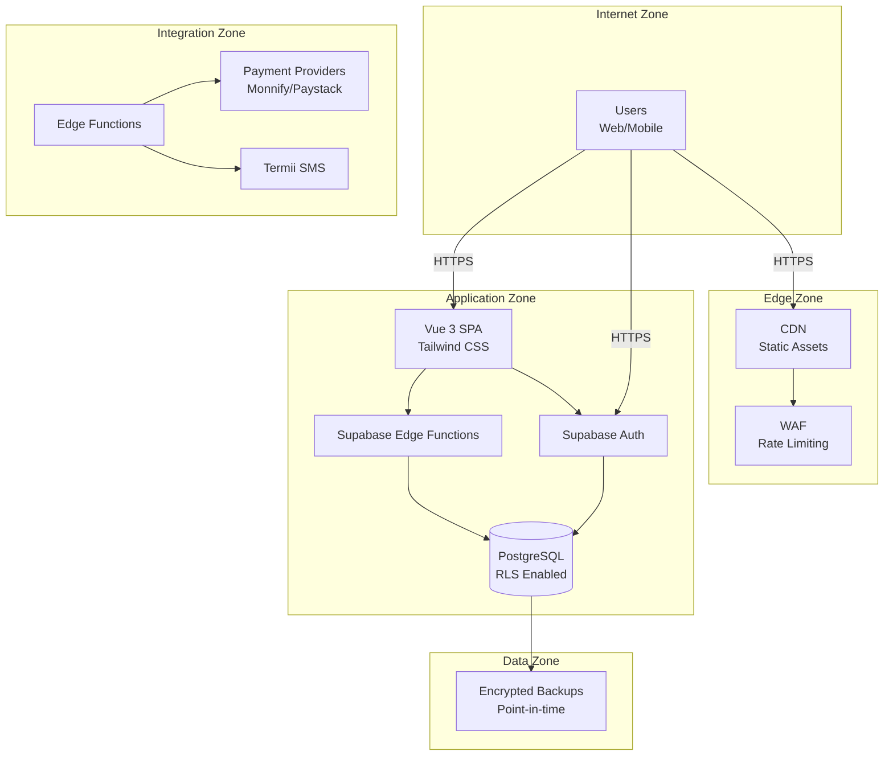

# Capstone Security Architecture

> **Version:** 1.0 (Phase 1)  
> **Last Updated:** July 2026  
> **Status:** MVP Foundation  

---

## Executive Summary

Capstone is a multi-tenant, offline-first School Financial Management Platform handling tuition payments, virtual accounts, and financial reporting. This security architecture is designed with the same rigor as banking and fintech platforms, implementing **Zero Trust**, **Least Privilege**, **Defense in Depth**, and **Secure by Default** principles.

### Security Posture Matrix

| Principle | Implementation | Why It Matters |
|-----------|----------------|----------------|
| **Zero Trust** | Never trust; always verify. Every request authenticated and authorized. | Prevents lateral movement if credentials compromised. |
| **Least Privilege** | Role-based permissions with granular capabilities. | Limits blast radius of account takeover. |
| **Defense in Depth** | Multiple security layers: network, application, database, data. | Redundancy if one layer fails. |
| **Secure by Default** | Encryption default-on, audit logging always enabled, MFA enforced. | Security cannot be accidentally bypassed. |
| **Fail Secure** | System denies access on error, not grants it. | Prevents security bypass on failures. |
| **Immutable Records** | No UPDATE/DELETE on ledger entries; corrections via new entries. | Prevents financial fraud and meets compliance. |
| **Complete Auditability** | Every financial action logged with old/new values. | Enables forensic investigation and compliance. |
| **Privacy by Design** | Data minimization, retention policies, encryption. | Meets GDPR/NDPA requirements. |
| **Tenant Isolation** | Strict RLS on every table; no cross-tenant queries. | Protects customer data from competitors. |
| **Offline-First Security** | Dexie encryption, queue signing, tamper detection. | Protects data on lost/stolen devices. |

---

## Architecture Overview



---

## Security Zones & Boundaries

### Zone 1: Client (Untrusted)
- Browser/mobile runtime
- IndexedDB storage (Dexie)
- No secrets stored in plaintext
- All inputs sanitized before processing

### Zone 2: Edge/Delivery
- CDN with strict CSP
- WAF (rate limiting, injection protection)
- TLS termination with HSTS
- Security headers enforced

### Zone 3: Application
- Supabase Edge Functions (stateless)
- Supabase Auth (JWT tokens)
- Input validation at boundary
- Authorization verified before every operation

### Zone 4: Data
- PostgreSQL with Row Level Security
- All tables have `school_id` column
- Database functions enforce business rules
- Audit triggers on all mutations

### Zone 5: Integrations
- Payment providers (via Edge Functions only)
- SMS providers
- Webhook signature verification required
- Secrets stored in Supabase Vault

---

## MVP Security Model

### Authentication Boundaries
```
┌─────────────────────────────────────────────────────────────┐
│                    LOGIN FLOW                               │
│                                                             │
│   User → Supabase Auth → JWT (school_id, role, profile_id) →  │
│   Frontend Stores Session → Every Request Validates JWT        │
└─────────────────────────────────────────────────────────────┘
```

### Authorization Boundaries
```
┌─────────────────────────────────────────────────────────────┐
│                 PERMISSION CHECK                            │
│                                                             │
│   API Call → Auth Header → Role Check → Permission Check →   │
│   RLS Policy → Database Operation                           │
└─────────────────────────────────────────────────────────────┘
```

---

## Security Controls by Component

| Component | Controls | Implementation Status |
|-----------|----------|----------------------|
| **Frontend** | CSP, XSS prevention, secure storage, route guards | Partial |
| **Auth** | Supabase Auth with email/password | Exists |
| **RLS** | `school_id` isolation on all tables | Exists (needs hardening) |
| **API** | Rate limiting, input validation | Missing |
| **Database** | Encryption at rest, audit triggers | Partial |
| **Sync** | Queue signing, tamper detection | Missing |
| **Offline** | Dexie encryption | Missing |

---

## Compliance Mapping

| Requirement | Control | Evidence |
|-------------|---------|----------|
| **SOC 2 CC5.1** | Authorization matrix | See authorization.md |
| **SOC 2 CC6.1** | Logical access controls | See authentication.md |
| **SOC 2 CC6.3** | Transaction logging | See audit_logging.md |
| **ISO 27001 A.9.2** | Secure authentication | See authentication.md |
| **ISO 27001 A.9.4** | Session management | See authentication.md |
| **NDPA 3.1** | Data protection | See encryption.md |
| **NDPA 3.3** | Consent mechanism | Part of auth flow |
| **PCI DSS 3.4** | Encryption | See encryption.md |
| **PCI DSS 10.1** | Audit trails | See audit_logging.md |

---

## Implementation Timeline

### Phase 1 (MVP - Current)
- [x] Basic RLS on core tables
- [x] Supabase Auth with email/password
- [x] Immutable ledger design
- [ ] MFA (via Supabase)
- [ ] Session management
- [ ] Request validation

### Phase 2 (Growth - 3-6 months)
- [ ] Field-level encryption
- [ ] Dexie client-side encryption
- [ ] Webhook signature verification
- [ ] Rate limiting
- [ ] Advanced threat detection

### Phase 3 (Enterprise - 6-12 months)
- [ ] Hardware security keys
- [ ] Formal compliance audit
- [ ] Penetration testing
- [ ] Security operations center
- [ ] Advanced fraud detection

---

## Related Documents

| Document | Purpose |
|----------|---------|
| [authentication.md](./authentication.md) | User authentication, MFA, session management |
| [authorization.md](./authorization.md) | RBAC model, permissions, role hierarchy |
| [row_level_security.md](./row_level_security.md) | Database RLS policies and implementation |
| [api_security.md](./api_security.md) | API gateway, rate limiting, input validation |
| [frontend_security.md](./frontend_security.md) | Client-side security controls |
| [offline_security.md](./offline_security.md) | Offline-first security architecture |
| [encryption.md](./encryption.md) | Encryption algorithms and key management |
| [audit_logging.md](./audit_logging.md) | Audit trail design and retention |
| [backup_strategy.md](./backup_strategy.md) | Backup procedures and recovery |
| [disaster_recovery.md](./disaster_recovery.md) | Incident response and DR procedures |
| [secure_development.md](./secure_development.md) | SDLC security practices |
| [threat_model.md](./threat_model.md) | STRIDE threat analysis |
| [deployment_security.md](./deployment_security.md) | Infrastructure security |
| [security_checklist.md](./security_checklist.md) | Security verification checklist |

---

## Common Mistakes to Avoid

1. **Never store secrets in frontend code** — Use Supabase Edge Functions
2. **Never trust `x-school-id` header** — Verify via JWT claims
3. **Never allow UPDATE on ledger entries** — Corrections via new entries only
4. **Never skip input validation** — All inputs are untrusted
5. **Never log sensitive data** — No passwords, tokens, or PII in logs
6. **Never underestimate offline security** — Device theft is the #1 threat in Africa
7. **Never use `:any` in TypeScript for security types** — Strict typing prevents errors