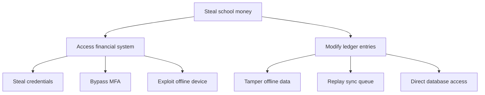
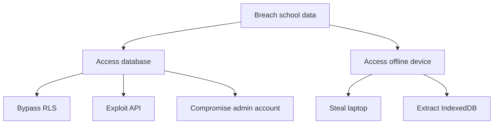

# Threat Model Security

> **Version:** 1.0 (Phase 1)  
> **Status:** Required Documentation  

---

## Why Threat Modeling Is Necessary

Without knowing what to defend against, security is **guesswork**. Threat modeling identifies:
- **Attack surfaces**
- **Threat actors**
- **Mitigation priorities**
- **Security gaps**

### Security Benefits

- **Focuses security efforts**
- **Prioritizes fixes**
- **Documents security decisions**
- **Supports compliance**

### Implementation Complexity: **Medium**
### Timeline: **MVP**

---

## STRIDE Threat Analysis

| Threat | Description | Example | Mitigation |
|--------|-------------|---------|------------|
| **Spoofing** | Impersonating legitimate user | Stolen password, fake session | MFA, session tokens, rate limiting |
| **Tampering** | Modifying data in transit/storage | Changed payment amount, offline db edit | Digital signatures, encryption, audit logs |
| **Repudiation** | Denying actions taken | "I didn't make that payment" | Audit trails, non-repudiation logs |
| **Information Disclosure** | Exposing confidential data | Cross-tenant query, device theft | RLS, encryption, least privilege |
| **Denial of Service** | Making system unavailable | API flood, DB corruption | Rate limiting, circuit breakers, backups |
| **Elevation of Privilege** | Gaining unauthorized access | User → Admin escalation | RBAC, MFA, session management |

---

## Identified Threats & Mitigations

### Authentication Threats

| Threat | Mitigation | Status |
|--------|------------|--------|
| **Credential stuffing** | Rate limiting, breach database check | ☐ |
| **Password guessing** | Account lockout, MFA | ☐ |
| **Session hijacking** | Short-lived tokens, HttpOnly cookies | ✅ (partial) |
| **MFA bypass** | Hardware keys, backup codes | ☐ |
| **Password reset abuse** | Email verification, single-use tokens | ☐ |

### Authorization Threats

| Threat | Mitigation | Status |
|--------|------------|--------|
| **Privilege escalation** | RBAC, role verification | ☐ |
| **Cross-tenant access** | RLS, strict policies | ✅ (partial) |
| **Horizontal privilege escalation** | Ownership checks | ☐ |
| **API header spoofing** | JWT claims verification | ❌ |
| **Mass assignment** | Input validation, schemas | ☐ |

### Data Threats

| Threat | Mitigation | Status |
|--------|------------|--------|
| **SQL injection** | Parameterized queries, RLS | ✅ |
| **XSS** | CSP, input sanitization | ☐ |
| **CSRF** | CSRF tokens, SameSite cookies | ☐ |
| **PII exposure** | Field encryption, access logs | ☐ |
| **Ledger tampering** | Immutable entries, audit trail | ✅ (partial) |

### Offline Threats

| Threat | Mitigation | Status |
|--------|------------|--------|
| **Device theft** | Dexie encryption | ❌ |
| **Queue manipulation** | Queue signing | ❌ |
| **Offline data theft** | Client-side encryption | ❌ |
| **Replay attacks** | Nonce tracking, timestamps | ❌ |
| **Clock drift** | Server time sync | ❌ |

### Infrastructure Threats

| Threat | Mitigation | Status |
|--------|------------|--------|
| **DDoS** | Rate limiting, CDN protection | ☐ |
| **Supply chain** | Dependency scanning, lockfiles | ☐ |
| **Cloud breach** | Encrypted backups, RLS | ☐ |
| **Insider threat** | Audit logs, separation of duties | ☐ |
| **Misconfiguration** | Infrastructure as code, scanning | ☐ |

---

## Attacker Personas

### Persona 1: School Insider

- **Motivation**: Financial fraud
- **Capabilities**: Valid credentials, device access
- **Attack Vector**: Payment manipulation, ledger tampering
- **Mitigation**: Audit trails, SoD, RBAC

### Persona 2: Competitor

- **Motivation**: Steal customer data
- **Capabilities**: Technical skill, resources
- **Attack Vector**: Cross-tenant queries, API abuse
- **Mitigation**: RLS, rate limiting, API monitoring

### Persona 3: Cybercriminal

- **Motivation**: Financial theft
- **Capabilities**: Script kiddie to expert
- **Attack Vector**: Credential theft, ransomware
- **Mitigation**: MFA, encryption, backups

### Persona 4: Script Kiddie

- **Motivation**: Vandalism
- **Capabilities**: Basic tools, no skill
- **Attack Vector**: Known vulnerabilities, simple attacks
- **Mitigation**: Dependency scanning, rate limiting

---

## Attack Trees

### Financial Theft Attack Tree

### Data Breach Attack Tree

---

## Security Controls Matrix

| Threat | Current Control | Gap | Priority |
|--------|-----------------|-----|----------|
| Credential stuffing | None | Rate limiting | P0 |
| Cross-tenant access | RLS | No header validation | P0 |
| Device theft | None | Dexie encryption | P0 |
| SQL injection | Supabase ORM | Input validation | P0 |
| Session hijacking | JWT | HttpOnly enforcement | P1 |
| Insider fraud | RBAC | Audit logging | P1 |

---

## Threat Modeling Process

### Quarterly Review

1. **Update threat landscape**
2. **Review new features**
3. **Assess mitigation effectiveness**
4. **Update documentation**

### Release Checklist

| Step | Responsible |
|------|-------------|
| Threat assessment | Security team |
| Mitigation implementation | Engineering |
| Testing | QA |
| Documentation update | Security |

---

## Implementation Priority

| Priority | Feature | Effort | Target |
|----------|---------|--------|--------|
| **P0** | Document current threats | Low | MVP |
| **P0** | Fix header spoofing | Low | MVP |
| **P0** | Add MFA requirement | Medium | MVP |
| **P1** | Quarterly threat review | Low | Growth |
| **P2** | Automated threat detection | High | Enterprise |